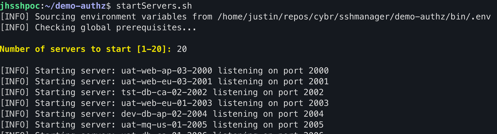
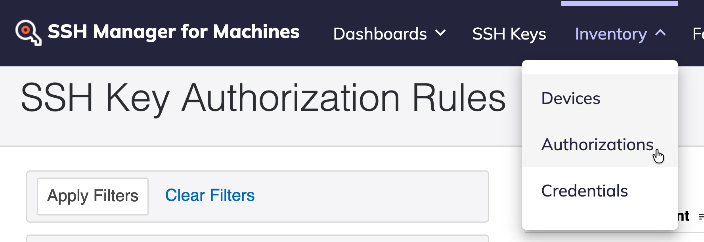

# Demo SSH Manager Authorization (25.3)
This collection of scripts can be used to demonstrate the realtime observability of SSH key usage on many SSH hosts at once leveraging SSH Manager's `authzhelper` as an `AuthorizedKeysCommand` within `sshd_config` on the target hosts.

### Links
Installation Guide:  [Install/Upgrade Demo](docs/INSTALLATION.md)

## Running the Demo

### Start a _few_ SSH servers:

```bash
startServers.sh
```



> **NOTE:** In most cases starting 10 - 15 servers will provide a good amount of activity and data during a demo

### Show the Authorization Rules in SSH Manager (TPP)
Log into SSH Manager, and navigate to `Inventory -> Authorization Rules` from the menu.



> **NOTE:** This screen should be blank, indicating no SSH public key authentications have yet been observed in your environment. (See [Cleanup / Reset Demo](#) if needed)

